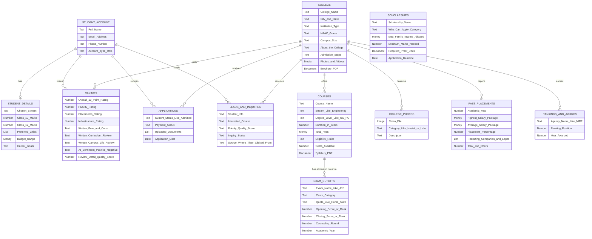

# Non-Technical Database Schema Overview

This diagram represents the entire database using plain English conceptually. There are no technical jargon or SQL types—just the categories of data we are storing for each part of the EduSearch platform and how those parts talk to each other.

