# EduSearch MySQL Database Schema

This document outlines the complete MySQL database schema for the EduSearch platform. It covers all core entities needed for students, colleges, courses, exams, applications, leads, reviews, and administration.

## Entity-Relationship Diagram (ERD)

```mermaid
erDiagram
    USERS {
        VARCHAR id PK
        VARCHAR name
        VARCHAR email
        VARCHAR phone
        VARCHAR password_hash
        ENUM role
        BOOLEAN email_verified
        TEXT image_url
        TIMESTAMP created_at
        TIMESTAMP updated_at
    }
    SESSIONS {
        VARCHAR id PK
        VARCHAR user_id FK
        VARCHAR token
        TIMESTAMP expires_at
        VARCHAR ip_address
        TEXT user_agent
    }
    STUDENT_PROFILES {
        VARCHAR user_id PK
        VARCHAR stream
        DECIMAL class_10_marks
        DECIMAL class_12_marks
        JSON preferred_cities
        INT budget_min
        INT budget_max
        TEXT career_goals
        INT counseling_points
    }
    COLLEGES {
        VARCHAR id PK
        VARCHAR name
        VARCHAR slug
        VARCHAR city
        VARCHAR state
        INT established_year
        ENUM type
        VARCHAR campus_area
        VARCHAR naac_grade
        VARCHAR approval_bodies
        TEXT about_description
        TEXT admission_process
        TEXT logo_url
        TEXT banner_url
        TEXT brochure_pdf_url
        TEXT video_tour_url
        BOOLEAN is_verified
        BOOLEAN is_sponsored
        VARCHAR claimed_by_user_id FK
        TIMESTAMP created_at
        TIMESTAMP updated_at
    }
    COLLEGE_RANKINGS {
        VARCHAR id PK
        VARCHAR college_id FK
        ENUM ranking_agency
        VARCHAR category
        INT year
        INT rank
    }
    COLLEGE_FACILITIES {
        VARCHAR id PK
        VARCHAR college_id FK
        VARCHAR facility_name
        TEXT description
        VARCHAR icon_name
    }
    COLLEGE_GALLERY {
        VARCHAR id PK
        VARCHAR college_id FK
        TEXT image_url
        ENUM category
        VARCHAR caption
        INT sort_order
    }
    COURSES {
        VARCHAR id PK
        VARCHAR college_id FK
        VARCHAR name
        VARCHAR stream
        VARCHAR specialization
        VARCHAR degree_level
        ENUM study_mode
        DECIMAL duration_years
        INT total_fees
        INT first_year_fees
        TEXT eligibility_criteria
        INT seats_available
        TEXT syllabus_pdf_url
        TEXT course_description
        TIMESTAMP created_at
    }
    EXAMS {
        VARCHAR id PK
        VARCHAR name
        VARCHAR slug
        VARCHAR full_name
        ENUM level
        VARCHAR mode
        DATE exam_date
        DATE result_date
        TEXT application_link
    }
    COURSE_EXAMS {
        VARCHAR course_id PK,FK
        VARCHAR exam_id PK,FK
    }
    CUTOFFS {
        VARCHAR id PK
        VARCHAR course_id FK
        VARCHAR exam_id FK
        INT year
        ENUM category
        VARCHAR quota
        VARCHAR counseling_round
        ENUM cutoff_type
        DECIMAL opening_value
        DECIMAL closing_value
        BOOLEAN is_expected
    }
    LEADS {
        VARCHAR id PK
        VARCHAR student_id FK
        VARCHAR college_id FK
        VARCHAR student_name
        VARCHAR student_phone
        VARCHAR student_email
        VARCHAR course_interest
        VARCHAR city
        ENUM quality_score
        ENUM status
        VARCHAR source_page
        VARCHAR utm_source
        VARCHAR utm_medium
        VARCHAR utm_campaign
        TIMESTAMP created_at
    }
    APPLICATIONS {
        VARCHAR id PK
        VARCHAR student_id FK
        VARCHAR college_id FK
        VARCHAR course_id FK
        ENUM status
        ENUM payment_status
        VARCHAR payment_id
        JSON documents_json
        TIMESTAMP applied_at
        TIMESTAMP updated_at
    }
    PLACEMENT_STATS {
        VARCHAR id PK
        VARCHAR college_id FK
        INT year
        DECIMAL average_package
        DECIMAL highest_package
        DECIMAL median_package
        INT total_recruiters
        DECIMAL placement_percentage
    }
    PLACEMENT_COMPANIES {
        VARCHAR id PK
        VARCHAR placement_stat_id FK
        VARCHAR company_name
        TEXT logo_url
        INT offers_made
    }
    REVIEWS {
        VARCHAR id PK
        VARCHAR college_id FK
        VARCHAR student_id FK
        DECIMAL academic_rating
        DECIMAL faculty_rating
        DECIMAL infrastructure_rating
        DECIMAL accommodation_rating
        DECIMAL placement_rating
        DECIMAL social_life_rating
        DECIMAL overall_rating
        INT batch_year
        VARCHAR course_id FK
        INT admission_year
        VARCHAR title
        TEXT course_curriculum_review
        TEXT faculty_review
        TEXT campus_life_review
        TEXT placement_review
        TEXT admission_process_review
        TEXT fees_and_financial_aid_review
        TEXT pros
        TEXT cons
        ENUM sentiment_label
        INT quality_score
        ENUM status
        INT helpful_votes
        TIMESTAMP created_at
    }
    AI_COUNSELOR_LOGS {
        VARCHAR id PK
        VARCHAR student_id FK
        JSON prompt_payload
        TEXT response_text
        JSON recommended_colleges_ids
        TIMESTAMP created_at
    }
    SCHOLARSHIPS {
        VARCHAR id PK
        VARCHAR name
        ENUM category
        VARCHAR target_category
        INT income_limit
        DECIMAL merit_percentage_min
        VARCHAR amount_description
        TEXT about_scholarship
        JSON required_documents
        TEXT application_link
        DATE deadline
        TIMESTAMP created_at
    }

    USERS ||--o{ SESSIONS : "creates"
    USERS ||--o| STUDENT_PROFILES : "has"
    USERS ||--o{ LEADS : "submits"
    USERS ||--o{ APPLICATIONS : "applies"
    USERS ||--o{ REVIEWS : "writes"
    USERS ||--o{ AI_COUNSELOR_LOGS : "interacts_with"
    
    COLLEGES ||--o{ COURSES : "offers"
    COLLEGES ||--o{ LEADS : "receives"
    COLLEGES ||--o{ APPLICATIONS : "receives"
    COLLEGES ||--o{ REVIEWS : "has"
    COLLEGES ||--o{ PLACEMENT_STATS : "reports"
    COLLEGES ||--o{ COLLEGE_GALLERY : "has_images"
    COLLEGES ||--o{ COLLEGE_RANKINGS : "earns"
    COLLEGES ||--o{ COLLEGE_FACILITIES : "provides"

    COURSES ||--o{ COURSE_EXAMS : "accepts"
    EXAMS ||--o{ COURSE_EXAMS : "is_accepted_for"
    
    COURSES ||--o{ CUTOFFS : "has_cutoffs"
    EXAMS ||--o{ CUTOFFS : "base_exam_for"
    
    PLACEMENT_STATS ||--o{ PLACEMENT_COMPANIES : "recruited_by"
    
    COLLEGES ||--o{ USERS : "claimed_by"
    COURSES ||--o{ APPLICATIONS : "applied_for"
    COURSES ||--o{ REVIEWS : "reviewed_in"
```



## SQL DDL Statements (MySQL 8.0)

### 1. Users & Authentication
Uses Better Auth standards. Includes a roles system mapping to Students, College Admins, and Super Admins.

```sql
CREATE TABLE `users` (
  `id` VARCHAR(36) PRIMARY KEY,
  `name` VARCHAR(255) NOT NULL,
  `email` VARCHAR(255) UNIQUE NOT NULL,
  `phone` VARCHAR(20) UNIQUE,
  `password_hash` VARCHAR(255),
  `role` ENUM('STUDENT', 'COLLEGE_ADMIN', 'SUPER_ADMIN') DEFAULT 'STUDENT',
  `email_verified` BOOLEAN DEFAULT FALSE,
  `image_url` TEXT,
  `created_at` TIMESTAMP DEFAULT CURRENT_TIMESTAMP,
  `updated_at` TIMESTAMP DEFAULT CURRENT_TIMESTAMP ON UPDATE CURRENT_TIMESTAMP
);

CREATE TABLE `sessions` (
  `id` VARCHAR(36) PRIMARY KEY,
  `user_id` VARCHAR(36) NOT NULL,
  `token` VARCHAR(255) UNIQUE NOT NULL,
  `expires_at` TIMESTAMP NOT NULL,
  `ip_address` VARCHAR(45),
  `user_agent` TEXT,
  FOREIGN KEY (`user_id`) REFERENCES `users`(`id`) ON DELETE CASCADE
);

CREATE TABLE `student_profiles` (
  `user_id` VARCHAR(36) PRIMARY KEY,
  `stream` VARCHAR(50),
  `class_10_marks` DECIMAL(5,2),
  `class_12_marks` DECIMAL(5,2),
  `preferred_cities` JSON,
  `budget_min` INT,
  `budget_max` INT,
  `career_goals` TEXT,
  `counseling_points` INT DEFAULT 0,
  FOREIGN KEY (`user_id`) REFERENCES `users`(`id`) ON DELETE CASCADE
);
```

### 2. Colleges & Courses

```sql
CREATE TABLE `colleges` (
  `id` VARCHAR(36) PRIMARY KEY,
  `name` VARCHAR(255) NOT NULL,
  `slug` VARCHAR(255) UNIQUE NOT NULL,
  `city` VARCHAR(100) NOT NULL,
  `state` VARCHAR(100) NOT NULL,
  `established_year` INT,
  `type` ENUM('PRIVATE', 'GOVERNMENT', 'DEEMED', 'AUTONOMOUS') NOT NULL,
  `campus_area` VARCHAR(50),
  `naac_grade` VARCHAR(10),
  `approval_bodies` VARCHAR(255), -- e.g., AICTE, UGC, BCI, MCI
  `about_description` TEXT,
  `admission_process` TEXT,
  `logo_url` TEXT,
  `banner_url` TEXT,
  `brochure_pdf_url` TEXT,
  `video_tour_url` TEXT,
  `is_verified` BOOLEAN DEFAULT FALSE,
  `is_sponsored` BOOLEAN DEFAULT FALSE,
  `claimed_by_user_id` VARCHAR(36), -- College Admin
  `created_at` TIMESTAMP DEFAULT CURRENT_TIMESTAMP,
  `updated_at` TIMESTAMP DEFAULT CURRENT_TIMESTAMP ON UPDATE CURRENT_TIMESTAMP,
  FOREIGN KEY (`claimed_by_user_id`) REFERENCES `users`(`id`) ON DELETE SET NULL
);

CREATE TABLE `college_rankings` (
  `id` VARCHAR(36) PRIMARY KEY,
  `college_id` VARCHAR(36) NOT NULL,
  `ranking_agency` ENUM('NIRF', 'The Week', 'Outlook', 'India Today', 'QS', 'EduSearch') NOT NULL,
  `category` VARCHAR(100), -- e.g., Overall, Engineering, MBA
  `year` INT NOT NULL,
  `rank` INT NOT NULL,
  FOREIGN KEY (`college_id`) REFERENCES `colleges`(`id`) ON DELETE CASCADE
);

CREATE TABLE `college_facilities` (
  `id` VARCHAR(36) PRIMARY KEY,
  `college_id` VARCHAR(36) NOT NULL,
  `facility_name` VARCHAR(100) NOT NULL, -- e.g., Hostel, Library, Gym, WiFi
  `description` TEXT,
  `icon_name` VARCHAR(50),
  FOREIGN KEY (`college_id`) REFERENCES `colleges`(`id`) ON DELETE CASCADE
);

CREATE TABLE `college_gallery` (
  `id` VARCHAR(36) PRIMARY KEY,
  `college_id` VARCHAR(36) NOT NULL,
  `image_url` TEXT NOT NULL,
  `category` ENUM('CAMPUS', 'HOSTEL', 'LABS', 'EVENTS', 'CLASSROOMS', 'OTHER') DEFAULT 'OTHER',
  `caption` VARCHAR(255),
  `sort_order` INT DEFAULT 0,
  FOREIGN KEY (`college_id`) REFERENCES `colleges`(`id`) ON DELETE CASCADE
);

CREATE TABLE `courses` (
  `id` VARCHAR(36) PRIMARY KEY,
  `college_id` VARCHAR(36) NOT NULL,
  `name` VARCHAR(255) NOT NULL,
  `stream` VARCHAR(100) NOT NULL, -- e.g., Engineering, Management, Medical
  `specialization` VARCHAR(150), -- e.g., Computer Science, Finance
  `degree_level` VARCHAR(50) NOT NULL, -- e.g., UG, PG, Diploma, Ph.D.
  `study_mode` ENUM('FULL_TIME', 'PART_TIME', 'DISTANCE', 'ONLINE') DEFAULT 'FULL_TIME',
  `duration_years` DECIMAL(3,1) NOT NULL,
  `total_fees` INT NOT NULL,
  `first_year_fees` INT,
  `eligibility_criteria` TEXT,
  `seats_available` INT,
  `syllabus_pdf_url` TEXT, -- Detail to attach syllabus specifically
  `course_description` TEXT, -- College specific descriptions of course outcomes
  `created_at` TIMESTAMP DEFAULT CURRENT_TIMESTAMP,
  FOREIGN KEY (`college_id`) REFERENCES `colleges`(`id`) ON DELETE CASCADE
);
```

### 3. Exams & Cutoffs

```sql
CREATE TABLE `exams` (
  `id` VARCHAR(36) PRIMARY KEY,
  `name` VARCHAR(50) UNIQUE NOT NULL, -- e.g., JEE Main
  `slug` VARCHAR(100) UNIQUE NOT NULL,
  `full_name` VARCHAR(255),
  `level` ENUM('NATIONAL', 'STATE', 'UNIVERSITY') NOT NULL,
  `mode` VARCHAR(50),
  `exam_date` DATE,
  `result_date` DATE,
  `application_link` TEXT
);

CREATE TABLE `course_exams` (
  `course_id` VARCHAR(36) NOT NULL,
  `exam_id` VARCHAR(36) NOT NULL,
  PRIMARY KEY (`course_id`, `exam_id`),
  FOREIGN KEY (`course_id`) REFERENCES `courses`(`id`) ON DELETE CASCADE,
  FOREIGN KEY (`exam_id`) REFERENCES `exams`(`id`) ON DELETE CASCADE
);

CREATE TABLE `cutoffs` (
  `id` VARCHAR(36) PRIMARY KEY,
  `course_id` VARCHAR(36) NOT NULL,
  `exam_id` VARCHAR(36) NOT NULL,
  `year` INT NOT NULL,
  `category` ENUM('GENERAL', 'OBC-NCL', 'SC', 'ST', 'EWS', 'PWD') NOT NULL,
  `quota` VARCHAR(50), -- e.g., Home State, All India
  `counseling_round` VARCHAR(50), -- e.g., Round 1, Round 3
  `cutoff_type` ENUM('RANK', 'SCORE', 'PERCENTILE') NOT NULL,
  `opening_value` DECIMAL(10,2), -- Represents opening rank/score
  `closing_value` DECIMAL(10,2), -- Represents closing rank/score
  `is_expected` BOOLEAN DEFAULT FALSE,
  FOREIGN KEY (`course_id`) REFERENCES `courses`(`id`) ON DELETE CASCADE,
  FOREIGN KEY (`exam_id`) REFERENCES `exams`(`id`) ON DELETE CASCADE
);
```

### 4. Leads & B2B Admissions

```sql
CREATE TABLE `leads` (
  `id` VARCHAR(36) PRIMARY KEY,
  `student_id` VARCHAR(36), -- NULL if guest inquiry
  `college_id` VARCHAR(36) NOT NULL,
  `student_name` VARCHAR(255) NOT NULL,
  `student_phone` VARCHAR(20) NOT NULL,
  `student_email` VARCHAR(255) NOT NULL,
  `course_interest` VARCHAR(255),
  `city` VARCHAR(100),
  `quality_score` ENUM('HIGH', 'MEDIUM', 'LOW') DEFAULT 'MEDIUM',
  `status` ENUM('NEW', 'CONTACTED', 'CONVERTED', 'JUNK') DEFAULT 'NEW',
  `source_page` VARCHAR(255), -- Page URL they submitted from
  `utm_source` VARCHAR(100), -- E.g. Google, Facebook, Organic
  `utm_medium` VARCHAR(100),
  `utm_campaign` VARCHAR(100),
  `created_at` TIMESTAMP DEFAULT CURRENT_TIMESTAMP,
  FOREIGN KEY (`student_id`) REFERENCES `users`(`id`) ON DELETE SET NULL,
  FOREIGN KEY (`college_id`) REFERENCES `colleges`(`id`) ON DELETE CASCADE
);

CREATE TABLE `applications` (
  `id` VARCHAR(36) PRIMARY KEY,
  `student_id` VARCHAR(36) NOT NULL,
  `college_id` VARCHAR(36) NOT NULL,
  `course_id` VARCHAR(36) NOT NULL,
  `status` ENUM('SUBMITTED', 'UNDER_REVIEW', 'SHORTLISTED', 'INTERVIEW_SCHEDULED', 'ADMITTED', 'REJECTED') DEFAULT 'SUBMITTED',
  `payment_status` ENUM('PENDING', 'PAID', 'FAILED') DEFAULT 'PENDING',
  `payment_id` VARCHAR(255), -- Razorpay Order ID
  `documents_json` JSON, -- Uploaded Docs Links [10th, 12th, etc.]
  `applied_at` TIMESTAMP DEFAULT CURRENT_TIMESTAMP,
  `updated_at` TIMESTAMP DEFAULT CURRENT_TIMESTAMP ON UPDATE CURRENT_TIMESTAMP,
  FOREIGN KEY (`student_id`) REFERENCES `users`(`id`) ON DELETE CASCADE,
  FOREIGN KEY (`college_id`) REFERENCES `colleges`(`id`) ON DELETE CASCADE,
  FOREIGN KEY (`course_id`) REFERENCES `courses`(`id`) ON DELETE CASCADE
);
```

### 5. Placements & Reviews

```sql
CREATE TABLE `placement_stats` (
  `id` VARCHAR(36) PRIMARY KEY,
  `college_id` VARCHAR(36) NOT NULL,
  `year` INT NOT NULL,
  `average_package` DECIMAL(10,2), -- In Lakhs (e.g., 4.2)
  `highest_package` DECIMAL(10,2),
  `median_package` DECIMAL(10,2),
  `total_recruiters` INT,
  `placement_percentage` DECIMAL(5,2),
  FOREIGN KEY (`college_id`) REFERENCES `colleges`(`id`) ON DELETE CASCADE
);

CREATE TABLE `placement_companies` (
  `id` VARCHAR(36) PRIMARY KEY,
  `placement_stat_id` VARCHAR(36) NOT NULL,
  `company_name` VARCHAR(150) NOT NULL,
  `logo_url` TEXT,
  `offers_made` INT,
  FOREIGN KEY (`placement_stat_id`) REFERENCES `placement_stats`(`id`) ON DELETE CASCADE
);

CREATE TABLE `reviews` (
  `id` VARCHAR(36) PRIMARY KEY,
  `college_id` VARCHAR(36) NOT NULL,
  `student_id` VARCHAR(36) NOT NULL,
  
  -- Ratings (1-10 Scale like Collegedunia)
  `academic_rating` DECIMAL(3,1) CHECK (academic_rating BETWEEN 1 AND 10),
  `faculty_rating` DECIMAL(3,1) CHECK (faculty_rating BETWEEN 1 AND 10),
  `infrastructure_rating` DECIMAL(3,1) CHECK (infrastructure_rating BETWEEN 1 AND 10),
  `accommodation_rating` DECIMAL(3,1) CHECK (accommodation_rating BETWEEN 1 AND 10),
  `placement_rating` DECIMAL(3,1) CHECK (placement_rating BETWEEN 1 AND 10),
  `social_life_rating` DECIMAL(3,1) CHECK (social_life_rating BETWEEN 1 AND 10),
  `overall_rating` DECIMAL(3,2), -- Auto generated Average
  
  -- Context
  `batch_year` INT NOT NULL,
  `course_id` VARCHAR(36),
  `admission_year` INT,
  
  -- Detailed Written Feedback (Mimicking extensive forms)
  `title` VARCHAR(255) NOT NULL,
  `course_curriculum_review` TEXT, -- Details on rigour, relevance
  `faculty_review` TEXT, -- Details on expertise, ratio
  `campus_life_review` TEXT, -- Details on fests, demographics (girls/boys ratio)
  `placement_review` TEXT, -- Details on companies, roles offered
  `admission_process_review` TEXT, -- Why chose this college, exams taken
  `fees_and_financial_aid_review` TEXT,
  
  -- Quick highlights
  `pros` TEXT,
  `cons` TEXT,
  
  -- Admin & NLP specific
  `sentiment_label` ENUM('POSITIVE', 'NEUTRAL', 'NEGATIVE'), -- Generated by Llama 3.1
  `quality_score` INT DEFAULT 0, -- Scaled 0-100 indicating review detail
  `status` ENUM('PENDING', 'APPROVED', 'REJECTED') DEFAULT 'PENDING',
  `helpful_votes` INT DEFAULT 0,
  `created_at` TIMESTAMP DEFAULT CURRENT_TIMESTAMP,
  FOREIGN KEY (`college_id`) REFERENCES `colleges`(`id`) ON DELETE CASCADE,
  FOREIGN KEY (`student_id`) REFERENCES `users`(`id`) ON DELETE CASCADE,
  FOREIGN KEY (`course_id`) REFERENCES `courses`(`id`) ON DELETE SET NULL
);
```

### 6. Assistant & Misc

```sql
CREATE TABLE `ai_counselor_logs` (
  `id` VARCHAR(36) PRIMARY KEY,
  `student_id` VARCHAR(36),
  `prompt_payload` JSON,
  `response_text` TEXT,
  `recommended_colleges_ids` JSON,
  `created_at` TIMESTAMP DEFAULT CURRENT_TIMESTAMP,
  FOREIGN KEY (`student_id`) REFERENCES `users`(`id`) ON DELETE SET NULL
);

CREATE TABLE `scholarships` (
  `id` VARCHAR(36) PRIMARY KEY,
  `name` VARCHAR(255) NOT NULL,
  `category` ENUM('GOVERNMENT', 'PRIVATE', 'INSTITUTIONAL') NOT NULL,
  `target_category` VARCHAR(100), -- SC/ST/OBC/Minority/General
  `income_limit` INT,
  `merit_percentage_min` DECIMAL(5,2),
  `amount_description` VARCHAR(255),
  `about_scholarship` TEXT, -- Context on why/how it exists
  `required_documents` JSON, -- Array of docs needed (Income proof, etc)
  `application_link` TEXT,
  `deadline` DATE,
  `created_at` TIMESTAMP DEFAULT CURRENT_TIMESTAMP
);
```

## Performance Setup

- MeiliSearch handles complex full-text search against `colleges` / `courses`. The schema here serves as the system of record.
- Use composite indexing in MySQL to optimize queries (e.g. `course_id, exam_id, category` in `cutoffs`).
- Storing items like `preferred_cities`, `facilities`, and `top_companies` as JSON reduces join overhead for simple display patterns while we can still index `features` via Next.js statically when pulling from MeiliSearch.
